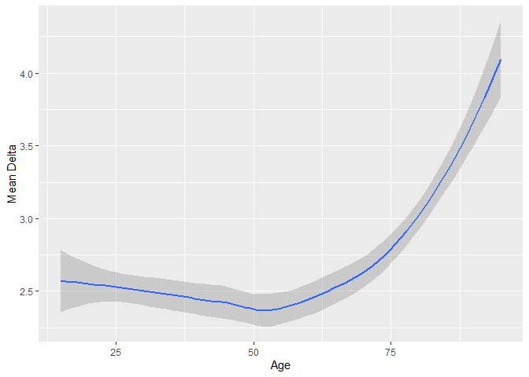

Statistical assignment 3
================
Simone Long\_135288
15/02/2020

## Read data

``` r
library(tidyverse)
library(data.table)

files <- dir(
             "C:/Users/simon/OneDrive/Documents/datan3_2019/data/UKDA-6614-tab/tab",
             pattern = "indresp",
             recursive = TRUE,
             full.names = TRUE)

files <- files[stringr::str_detect(files, "ukhls")]

vars <- c("memorig", "sex_dv", "age_dv", "vote6")

for (i in 1:7) {
        varsToSelect <- paste(letters[i], vars, sep = "_")
        varsToSelect <- c("pidp", varsToSelect)
        data <- fread(files[i], select = varsToSelect)
        if (i == 1) {
                all7 <- data  
        }
        else {
                all7 <- full_join(all7, data, by = "pidp")
        }
        rm(data)
} 
```

## Reshape data (20 points)

``` r
Long <- all7 %>%
  gather(a_memorig:g_vote6, key = "variable", value = "value") %>%
  separate(variable, into = c("wave", "variable"), sep = "_", extra =  "merge") %>%
   spread(key = variable, value = value)
```

## Filter and recode (20 points)

``` r
Long <- Long %>%
        filter(memorig == 1) %>%
        mutate(sex_dv = ifelse(sex_dv == 2, "female",
                           ifelse(sex_dv == 1, "male", NA))) %>%
        mutate(vote6 = recode(vote6,
                              `1` = 1,
                              `2` = 2,
                              `3` = 3,
                              `4` = 4,
                              .default = NA_real_))
        
  table(Long$sex_dv)
```

    ## 
    ## female   male 
    ## 117665 100342

``` r
  table(Long$vote6)
```

    ## 
    ##     1     2     3     4 
    ## 21660 70952 56134 52145

## Calculate mean political interest by sex and wave (10 points)

``` r
meanVote6 <- Long %>%
        group_by(wave, sex_dv) %>%
        filter(!is.na(sex_dv)) %>%
        summarise(voteavg = mean(vote6, na.rm = TRUE))
        
meanVote6
```

    ## # A tibble: 14 x 3
    ## # Groups:   wave [7]
    ##    wave  sex_dv voteavg
    ##    <chr> <chr>    <dbl>
    ##  1 a     female    2.84
    ##  2 a     male      2.53
    ##  3 b     female    2.82
    ##  4 b     male      2.51
    ##  5 c     female    2.87
    ##  6 c     male      2.54
    ##  7 d     female    2.89
    ##  8 d     male      2.55
    ##  9 e     female    2.87
    ## 10 e     male      2.51
    ## 11 f     female    2.81
    ## 12 f     male      2.47
    ## 13 g     female    2.73
    ## 14 g     male      2.42

## Reshape the data frame with summary statistics (20 points)

``` r
meanVote6 %>%
       spread(wave, voteavg)
```

    ## # A tibble: 2 x 8
    ##   sex_dv     a     b     c     d     e     f     g
    ##   <chr>  <dbl> <dbl> <dbl> <dbl> <dbl> <dbl> <dbl>
    ## 1 female  2.84  2.82  2.87  2.89  2.87  2.81  2.73
    ## 2 male    2.53  2.51  2.54  2.55  2.51  2.47  2.42

Across all seven waves, women tend to be slightly less interested in
politics than men on average. There are a variety of possible reasons
for this. It could be that the sample of women for this dataset is
uniquely disinterested in poitics. It could also be that the mean for
interest in politics could be influenced in one direction based on age,
rather than sex alone (i.e. maybe younger/older people tend to be
more/less interested). But from a psychological perspective, it could be
that women don’t tend to engage as much politically because they don’t
see themselves represented in politics; there are far more male
politicans than female, so it is conceivable that women don’t think
about politics as much because they don’t feel they have a voice.

## Estimate stability of political interest (30 points)

``` r
Long <- Long %>%
  pivot_wider(id_cols = c(pidp, sex_dv), names_from = wave,
              values_from = c(age_dv, vote6))

Long <- Long %>%
  drop_na(vote6_a:vote6_g) %>%
  select(-c(age_dv_b:age_dv_g))

Long <- Long %>%
  mutate(delta = 
           abs(vote6_b - vote6_a) +
           abs(vote6_c - vote6_b) +
           abs(vote6_d - vote6_c) +
           abs(vote6_e - vote6_d) +
           abs(vote6_f - vote6_e) +
           abs(vote6_g - vote6_f))

sex.mean <- Long %>%
  group_by(sex_dv) %>%
  summarise(delta.mean = mean(delta))

knitr::kable(
  sex.mean,
 col.names = c("Sex", "Mean Delta")
)
```

| Sex    | Mean Delta |
| :----- | ---------: |
| female |   2.494877 |
| male   |   2.527760 |

``` r
age.mean <- Long %>%
  group_by(age_dv_a) %>%
  summarise(delta.mean = mean(delta))

knitr::kable(
  age.mean,
 col.names = c("Age", "Mean Delta")
)
```

| Age | Mean Delta |
| --: | ---------: |
|  15 |   2.000000 |
|  16 |   2.778571 |
|  17 |   2.545454 |
|  18 |   2.826087 |
|  19 |   2.816092 |
|  20 |   2.393258 |
|  21 |   3.082353 |
|  22 |   2.588235 |
|  23 |   2.423729 |
|  24 |   2.150000 |
|  25 |   2.556962 |
|  26 |   2.218182 |
|  27 |   2.576271 |
|  28 |   2.295918 |
|  29 |   2.643443 |
|  30 |   2.605769 |
|  31 |   2.682692 |
|  32 |   2.558559 |
|  33 |   2.466981 |
|  34 |   2.334975 |
|  35 |   2.689923 |
|  36 |   2.431818 |
|  37 |   2.522267 |
|  38 |   2.575540 |
|  39 |   2.557003 |
|  40 |   2.391045 |
|  41 |   2.444090 |
|  42 |   2.396285 |
|  43 |   2.278986 |
|  44 |   2.387960 |
|  45 |   2.434931 |
|  46 |   2.547231 |
|  47 |   2.479876 |
|  48 |   2.191083 |
|  49 |   2.320388 |
|  50 |   2.347985 |
|  51 |   2.372990 |
|  52 |   2.590604 |
|  53 |   2.355634 |
|  54 |   2.381757 |
|  55 |   2.496350 |
|  56 |   2.452381 |
|  57 |   2.438406 |
|  58 |   2.168790 |
|  59 |   2.382353 |
|  60 |   2.387454 |
|  61 |   2.318052 |
|  62 |   2.451704 |
|  63 |   2.470914 |
|  64 |   2.520900 |
|  65 |   2.460377 |
|  66 |   2.538194 |
|  67 |   2.414847 |
|  68 |   2.709360 |
|  69 |   2.502564 |
|  70 |   2.688995 |
|  71 |   2.942708 |
|  72 |   2.780899 |
|  73 |   2.987578 |
|  74 |   2.820144 |
|  75 |   2.747968 |
|  76 |   2.811321 |
|  77 |   2.953704 |
|  78 |   2.918367 |
|  79 |   3.247059 |
|  80 |   2.962025 |
|  81 |   3.130435 |
|  82 |   3.113208 |
|  83 |   2.846154 |
|  84 |   2.966667 |
|  85 |   2.684210 |
|  86 |   2.923077 |
|  87 |   3.100000 |
|  88 |   3.500000 |
|  89 |   4.333333 |
|  90 |   3.750000 |
|  91 |   3.000000 |
|  95 |   5.000000 |

``` r
library(ggplot2)
age.mean %>%
  ggplot(aes(x=age_dv_a, y=delta.mean, group=1)) +
  stat_smooth(method = 'loess', formula = y~x) +
  xlab("Age") +
  ylab("Mean Delta")
```

<!-- -->

When looking at the mean change in political interest broken down by
gender, it seems that men tend slightly more to vary in degree of
interest than do women. This difference isn’t incredibly significant,
but could potentially be explained by such factors as female
representation in politics influencing how much/little women participate
and/or the increasing presence of news on social media causing people to
engage more/less.

As far as age is concerned, there doesn’t appear to be much variation in
political interest. However, it does appear that those older than 85 do
tend to alternate between greater and lesser engagement. This could
quite simply be due to apathy brought on by old age, as the older one
gets, the less they may feel they are affected by politics.
